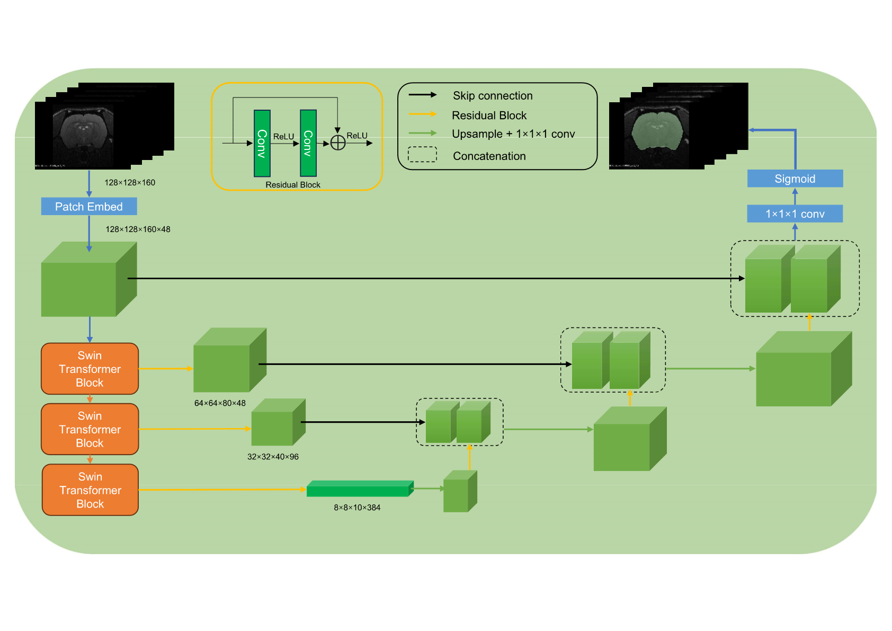

# Overview

This repository contains the training code of RSS-Net 

# Installing Dependencies

Our framework is developed based on Python 3.9, [PyTorch 2.0.0](https://pytorch.org/), [MONAI](https://monai.io/), and [nnUNet](https://github.com/MIC-DKFZ/nnUNet). 

Dependencies can be installed using:

``` bash
conda create -n <env_name> python=3.9

conda activate <env_name>

# CUDA 11.7
conda install pytorch==2.0.0 torchvision==0.15.0 torchaudio==2.0.0 pytorch-cuda=11.7 -c pytorch -c nvidia
# CUDA 11.8
conda install pytorch==2.0.0 torchvision==0.15.0 torchaudio==2.0.0 pytorch-cuda=11.8 -c pytorch -c nvidia
# CPU Only
conda install pytorch==2.0.0 torchvision==0.15.0 torchaudio==2.0.0 cpuonly -c pytorch

pip install -r requirements.txt
```

# Models

Our network architecture is illustrated in the following diagram:



# Data Description

We trained the model using MRI data from rodent brains collected from 89 centers. You can download the pre-trained model files and the annotated brain masks [Google Drive](https://drive.google.com/drive/folders/1cTlFFGL9iTUoZOT5Rgqi2ZAyqyPlXYd-).
You can find the download links for these datasets in our article (***in submission***)

| Dataset           |          | MultiRat | StdRat | C Rat | TRat  | C Mouse | NeAt        |
|-------------------|----------|----------|--------|-------|-------|---------|-------------|
| Participant       |          | 646      | 209    | 132   | 24    | 16      | 10          |
| Image             |          | 751      | 209    | 132   | 24    | 16      | 10          |
| Sex               | Male     | 505      | 116    | 132   |       | 16      | 10          |
|                   | Female   | 141      | 93     |       | 24    |         |             |
| Strain            | Wistar   | 256      | 189    | 16    | 24    |         |             |
|                   | SD       | 220      |        | 94    |       |         |             |
|                   | LE       | 80       | 10     | 22    |       |         |             |
|                   | F344     | 60       | 10     |       |       |         |             |
|                   | LH       | 30       |        |       |       |         |             |
|                   | WTC      |          |        |       |       | 16      |             |
|                   | IC       |          |        |       |       |         | 10          |
| Age(months)       | 0-2      | 164      | 88     |       |       |         |             |
|                   | 2-4      | 308      | 57     |       |       |         | 12-14 weeks |
|                   | 4-6      | 16       | 2      |       |       |         |             |
|                   | 6-12     | 22       | 2      |       |       |         |             |
|                   | 12-20    | 28       |        |       |       |         |             |
|                   | -        | 108      | 60     | adult | adult | adult   |             |
| Weight(grams)     | 100-200  | 71       | 20     |       |       |         |             |
|                   | 200-250  | 78       | 71     |       |       |         |             |
|                   | 250-300  | 97       | 56     |       |       |         |             |
|                   | 300-350  | 173      | 40     |       |       |         |             |
|                   | 350-400  | 81       | 13     |       |       |         |             |
|                   | 400-700  | 94       | 9      |       |       |         |             |
|                   | -        | 52       |        | 132   |       | 16      | 25-30 grams |
| Vendor            | Bruker   | 568      | 180    | 132   | 24    | 16      | 10          |
|                   | MS       | 10       |        |       |       |         |             |
|                   | SD       | 68       |        |       |       |         |             |
|                   | A/B      |          | 10     |       |       |         |             |
|                   | Varian   |          | 10     |       |       |         |             |
|                   | Clinscan |          | 9      |       |       |         |             |
| Field Strength(T) | 3        | 10       |        |       |       |         |             |
|                   | 4.7      | 40       | 10     |       |       |         |             |
|                   | 7        | 309      | 79     |       |       |         |             |
|                   | 9.4      | 229      | 100    | 132   | 24    | 16      | 10          |
|                   | 11.7     | 30       |        |       |       |         |             |
|                   | 14       |          | 10     |       |       |         |             |
|                   | 14.1     | 28       |        |       |       |         |             |
|                   | 17.2     |          | 10     |       |       |         |             |

# Dataset Format
``` bash
datasets/Dataset002_RatsBarin/
├── dataset.json
├── imagesTr
│   ├── RATS_001_0000.nii.gz
│   ├── RATS_002_0000.nii.gz
│   ├── ...
├── imagesTs
│   ├── RATS_485_0000.nii.gz
│   ├── RATS_486_0000.nii.gz
│   ├── ...
└── labelsTr
    ├── RATS_001.nii.gz
    ├── RATS_002.nii.gz
    ├── ...
```

# Data preprocessing

Data preprocessing can be performed using the nnU-Net's plan and preprocess modules.
> Experiment planning and preprocessing
Given a new dataset, nnU-Net will extract a dataset fingerprint (a set of dataset-specific properties such as image sizes, voxel spacings, intensity information etc). This information is used to design three U-Net configurations. Each of these pipelines operates on its own preprocessed version of the dataset.
> 
> The easiest way to run fingerprint extraction, experiment planning and preprocessing is to use:
> 
> nnUNetv2_plan_and_preprocess -d DATASET_ID --verify_dataset_integrity
Where DATASET_ID is the dataset id (duh). We recommend --verify_dataset_integrity whenever it's the first time you run this command. This will check for some of the most common error sources!
> 
> You can also process several datasets at once by giving -d 1 2 3 [...]. If you already know what U-Net configuration you need you can also specify that with -c 3d_fullres (make sure to adapt -np in this case!). For more information about all the options available to you please run nnUNetv2_plan_and_preprocess -h.
> 
> nnUNetv2_plan_and_preprocess will create a new subfolder in your nnUNet_preprocessed folder named after the dataset. Once the command is completed there will be a dataset_fingerprint.json file as well as a nnUNetPlans.json file for you to look at (in case you are interested!). There will also be subfolders containing the preprocessed data for your UNet configurations.
> 
> [Optional] If you prefer to keep things separate, you can also use nnUNetv2_extract_fingerprint, nnUNetv2_plan_experiment and nnUNetv2_preprocess (in that order).

# Training

``` bash
python main_train.py
```
By default, training will be conducted using 5 folds.

# Citation
If you find this repository useful, please consider citing our paper:

```
Will be updated after the publication of the paper.
```